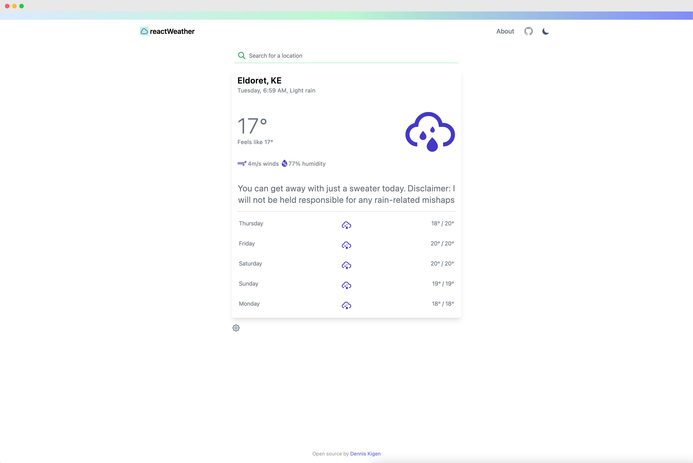

<div align="center"> 
  
</div>



[](https://github.com/denniskigen/react-weather/actions/workflows/validate.yml)  [](https://coveralls.io/github/denniskigen/react-weather?branch=main)

[React Weather](https://react-weather.denniskigen.com) is a beautiful weather app built on top of the [OpenWeatherMap API](https://openmweathermap.org/api).

## Getting started

- Sign up over at [openweathermap.org](https://openweathermap.org/appid) and get an API key.
- Fork the project and clone it locally.
- Install dependencies using [pnpm](https://pnpm.io/installation):

  ```sh
  pnpm install
  ```

- Create a file at the root of the project called `.env.local` with the following contents:

  ```
  VITE_API_URL = 'https://api.openweathermap.org/data/2.5'
  VITE_API_KEY = The API key you obtained from openweathermap.org
  VITE_ICON_URL = 'https://openweathermap.org/img/w'
  ```
